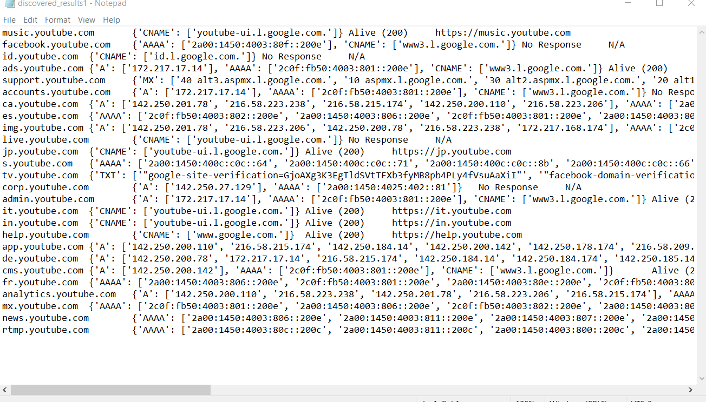

DNS + Subdomain Enumeration Tool (GUI)
 Introduction

The DNS + Subdomain Enumeration Tool is a modern GUI-based application built with Python and PyQt5.
It allows cybersecurity students, penetration testers, and researchers to perform DNS lookups and brute-force subdomain discovery in an easy-to-use interface.

This tool combines the power of DNS record resolution with subdomain enumeration, making it a handy utility for reconnaissance and information gathering.

 Features

Resolve DNS records (A, AAAA, CNAME, MX, TXT)

Perform subdomain brute-forcing using a custom wordlist

Multithreaded scanning for speed and efficiency

Modern GUI with Dark/Light themes

Real-time results displayed in tables

Export results to CSV for reporting

 Installation

Clone the repository:
```bash
git clone https://github.com/Mikey-19/DNS-Subdomenum.git
```

Navigate into the folder:
```bash
cd DNS-Subdomenum
```

Install dependencies:
```bash
pip install -r requirements.txt
```

requirements.txt
```bash
PyQt5
dnspython
requests
```

Additionally, the results can be saved into a text file using the 'Save Results' button.

Conclusion

This tool provides a simple yet powerful approach to discovering hidden subdomains and analyzing their DNS records. 
By combining enumeration with a modern GUI and progress tracking, it is highly useful for security assessments and academic research projects.


Screenshots

Figure 1: Main Interface (Dark Mode)

 
Figure 2: Running Subdomain Enumeration with Progress Bar & Discovered Subdomains and DNS Records 


 
 

Figure 4: Exported Results File Confirmation

  


  License

This project is licensed under the MIT License – you are free to use, modify, and distribute it.
